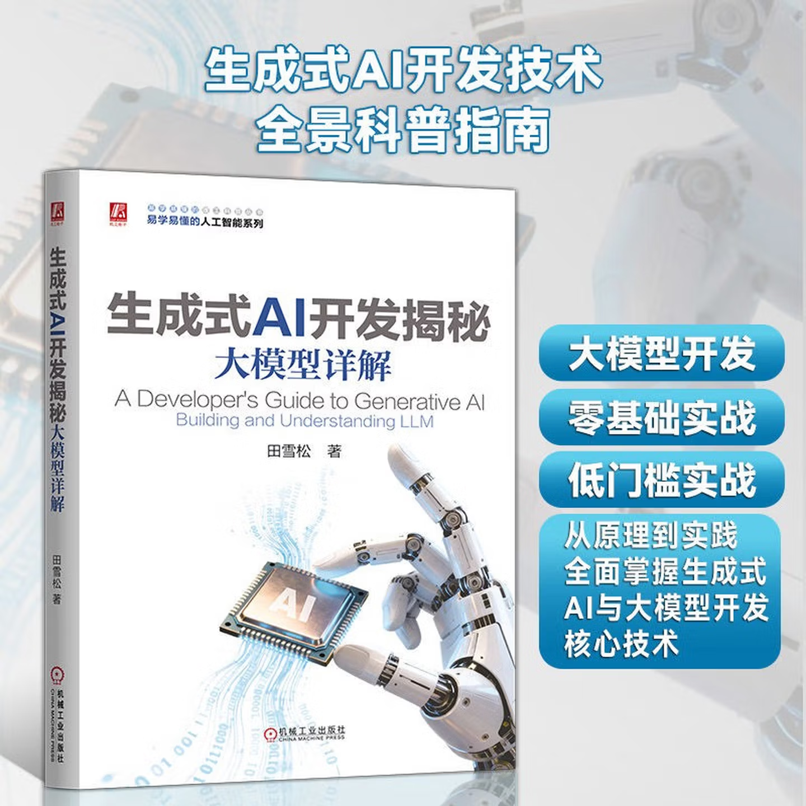

# 生成式AI开发揭秘：大模型详解
本代码库包含《生成式AI开发揭秘：大模型详解》全部源代码以及各章节摘要和小结。本书详细介绍了基于大模型的生成式AI应用与开发技术，涵盖了自然语言处理、语音识别以及计算机视觉与图像生成等不同领域。为了帮助读者更深入理解大模型原理，本书最后三章还深入探讨了大模型部署、评估以及预训练与微调等技术。本书采用了通俗易懂的语言来描述技术与算法，力争让读者在没有相关知识的情况下就能理解。阅读本书并不要求具备高深的算法知识，只要对机器学习有一定的理解并具有基本的编程知识即可。总的来说，本书全面而系统地介绍了生成式AI与大模型研发技术，是了解和进入这一领域不可多得的技术参考书籍。

## 目录

请点击目录查看章节摘要及相关示例代码：

第一章  [走进生成式AI](./chapter01/chapter01.ipynb)

第二章  [开发生成式AI](./chapter02/chapter02.ipynb)

第三章  [转换器架构](./chapter03/chapter03.ipynb)

第四章  [自然语言处理](./chapter04/chapter04.ipynb)

第五章  [音频处理](./chapter05/chapter05.ipynb)

第六章  [计算机视觉与图像生成](./chapter06/chapter06.ipynb)

第七章  [大模型增强与集成](./chapter07/chapter07.ipynb)

第八章  [大模型部署与优化](./chapter08/chapter08.ipynb)

第九章  [大模型评估与测试](./chapter09/chapter09.ipynb)

第十章  [大模型预训练与微调](./chapter10/chapter10.ipynb)

## 联系作者

本书前言部分包括有作者邮箱，欢迎读者在阅读过程与作者沟通，共同提升本书内容的质量与价值。

## 购买

### 在线

可在京东、淘宝等购物平台，直接搜索书名称《生成式AI开发揭秘：大模型详解》购买：

### 书店

全国各大书店均有出售：

